# The VibeCheck Workflow

**From Idea to Secure Deployment**

This workflow takes you from "I have an idea" to "It's live and secure" — with checkpoints at every stage.

---

## The Process (Visual)

```mermaid
flowchart TD
    subgraph IDEATE["1️⃣ IDEATE"]
        A[💡 Describe Your Project] --> B{Which Tool?}
        B -->|Beginner| C[Lovable / v0 / Bolt]
        B -->|Intermediate| D[Kiro Specs / Cursor]
        B -->|Advanced| E[Claude Code / Cline]
    end

    subgraph BUILD["2️⃣ BUILD POC"]
        C --> F[🚀 Get Something Working]
        D --> F
        E --> F
        F --> G[Iterate Until MVP]
    end

    subgraph SPEC["3️⃣ SPEC IT OUT"]
        G --> H[📋 Write Requirements]
        H --> I[Design Architecture]
        I --> J[Create Task List]
    end

    subgraph SECURE["4️⃣ SECURE"]
        J --> K[🔒 Run Security Checklist]
        K --> L{Secrets Exposed?}
        L -->|Yes| M[Fix .env + .gitignore]
        M --> K
        L -->|No| N[Run Secrets Scanner]
        N --> O{Clean?}
        O -->|No| M
        O -->|Yes| P[✅ Ready for Git]
    end

    subgraph SOURCE["5️⃣ SOURCE CONTROL"]
        P --> Q[git init locally]
        Q --> R[Commit Often]
        R --> S{Ready for GitHub?}
        S -->|Not Yet| R
        S -->|Yes| T[Create GitHub Repo]
        T --> U{Public or Private?}
        U -->|Public| V[⚠️ Extra Scrutiny]
        U -->|Private| W[Push to GitHub]
        V --> W
    end

    subgraph DEPLOY["6️⃣ DEPLOY"]
        W --> X{Where to Deploy?}
        X -->|Easy Button| Y[Vercel / Netlify / Railway]
        X -->|AWS/Cloud| Z[Generate IaC]
        Z --> AA[Run Cost Estimator]
        AA --> AB[Scan with Checkov]
        AB --> AC{IaC Clean?}
        AC -->|No| AD[Fix Issues]
        AD --> AB
        AC -->|Yes| AE[Deploy to Cloud]
        Y --> AF[🎉 LIVE!]
        AE --> AF
    end

    style IDEATE fill:#1E293B,stroke:#10B981,color:#fff
    style BUILD fill:#1E293B,stroke:#10B981,color:#fff
    style SPEC fill:#1E293B,stroke:#10B981,color:#fff
    style SECURE fill:#1E293B,stroke:#10B981,color:#fff
    style SOURCE fill:#1E293B,stroke:#10B981,color:#fff
    style DEPLOY fill:#1E293B,stroke:#10B981,color:#fff
```



---

## Step-by-Step Breakdown

### 1️⃣ IDEATE — Describe Your Project

**Goal:** Get your idea out of your head and into a tool.

| Your Level | Tool | What to Do |
|------------|------|------------|
| 🌱 Beginner | Lovable, v0, Bolt | Type what you want: "Build me a todo app with dark mode" |
| 🔧 Intermediate | Kiro, Cursor | Write a spec first, then let AI execute |
| 🚀 Advanced | Claude Code, Cline | Describe the architecture, let agents plan |

**Pro Tips:**
- Be specific: "A dashboard" → "A dashboard showing my GitHub commits by week"
- Include constraints: "Use Supabase for auth, dark theme, mobile-friendly"
- Reference examples: "Like Notion but simpler"

---

### 2️⃣ BUILD POC — Get Something Working

**Goal:** A working prototype, even if ugly.

```
Iterate until you can:
✅ Click through the main flow
✅ See real (or mock) data
✅ Show someone and explain it
```

**Don't worry about:**
- Perfect code
- Security (yet)
- Performance
- Edge cases

**Time target:** 30 minutes to 2 hours

---

### 3️⃣ SPEC IT OUT — Document Your Intent

**Goal:** Turn your POC into a real project with specs.

**If using Kiro:**
```
.kiro/specs/my-feature/
├── requirements.md    # User stories + acceptance criteria
├── design.md          # Architecture decisions
└── tasks.md           # Implementation checklist
```

**If using Claude Code:**
```
CLAUDE.md              # Project context + rules
docs/
├── requirements.md    # What we're building
└── architecture.md    # How it fits together
```

**Key Questions:**
- What are the user stories?
- What's the data model?
- What APIs do we need?
- What are the security requirements?

---

### 4️⃣ SECURE — The 7-Point Checklist

**Goal:** Catch security issues BEFORE they hit GitHub.

```bash
# The VibeCheck Security Checklist
□ 1. Never commit secrets → Use .env files
□ 2. Review auth code → AI often skips this
□ 3. Check .gitignore → Verify it's complete
□ 4. Scope API permissions → Least privilege
□ 5. Run secrets scanner → gitleaks, git-secrets
□ 6. Review DB queries → SQL injection check
□ 7. Test error handling → No stack traces exposed
```

**Run a secrets scan:**
```bash
# Install gitleaks
brew install gitleaks

# Scan your repo
gitleaks detect --source . --verbose
```

**Common .gitignore additions:**
```gitignore
# Secrets
.env
.env.local
.env.*.local
*.pem
*.key

# Dependencies
node_modules/
.venv/
__pycache__/

# Build
.next/
dist/
build/

# IDE
.vscode/
.idea/
```

---

### 5️⃣ SOURCE CONTROL — Git Before GitHub

**Goal:** Version control locally, then push when ready.

**Local Git First:**
```bash
# Initialize
git init
git add .
git commit -m "Initial commit: MVP working"

# Keep committing as you work
git add .
git commit -m "Add user authentication"
```

**Before GitHub, ask:**
- [ ] Is `.gitignore` complete?
- [ ] Did secrets scanner pass?
- [ ] Should this be public or private?
- [ ] Is there anything embarrassing in commit history?

**Push to GitHub:**
```bash
# Create repo (using GitHub CLI)
gh repo create my-project --public --source=. --push

# Or private
gh repo create my-project --private --source=. --push
```

**Public Repo Extra Scrutiny:**
- No API keys, tokens, or secrets
- No internal company info
- No PII (names, emails, addresses)
- License file included
- README explains the project

---

### 6️⃣ DEPLOY — Ship It

**Goal:** Get your app live.

#### Easy Button (Recommended for Beginners)

| Platform | Best For | Free Tier |
|----------|----------|-----------|
| [Vercel](https://vercel.com) | Next.js, React | 100GB bandwidth |
| [Netlify](https://netlify.com) | Static sites, JAMstack | 100GB bandwidth |
| [Railway](https://railway.app) | Full-stack, databases | $5 credit/mo |

```bash
# Vercel (one command)
npx vercel

# Netlify
npx netlify deploy --prod

# Railway
railway up
```

#### AWS/Cloud (Advanced)

**Step 1: Generate Infrastructure as Code**
```bash
# Use Claude Code or Kiro to generate Terraform
"Generate Terraform for a Next.js app with:
- S3 bucket for static assets
- CloudFront distribution
- Lambda@Edge for SSR
- DynamoDB for data"
```

**Step 2: Estimate Costs**
```bash
# Use Infracost
brew install infracost
infracost breakdown --path .
```

**Step 3: Scan for IaC Issues**
```bash
# Install Checkov
pip install checkov

# Scan Terraform
checkov -d . --framework terraform

# Common issues it catches:
# - S3 buckets without encryption
# - Security groups too permissive
# - IAM policies too broad
# - Missing logging/monitoring
```

**Step 4: Deploy**
```bash
terraform init
terraform plan
terraform apply
```

---

## Decision Flowchart: Where Should I Deploy?


---

## Quick Reference: Tools by Stage

| Stage | Beginner | Intermediate | Advanced |
|-------|----------|--------------|----------|
| **Ideate** | Lovable, v0 | Kiro, Cursor | Claude Code |
| **Build** | Bolt, Replit | Cursor, Windsurf | Claude Code, Cline |
| **Spec** | — | Kiro Specs | CLAUDE.md |
| **Secure** | gitleaks | gitleaks + Checkov | Custom agents |
| **Source** | GitHub Desktop | git CLI | git + hooks |
| **Deploy** | Vercel, Netlify | Railway, Render | Terraform + AWS |

---

## The VibeCheck Mantra

```
Sip.     → Take your time, describe what you want
Secure.  → Run the checklist before you ship
Ship.    → Get it live, iterate from there
```

---

*"80% of AI-generated code contains vulnerabilities. This workflow helps you avoid them."*
